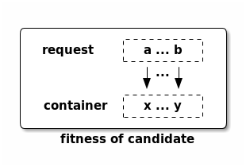

# Algorithms

The following section describe the different approaches for stitching the 
request graph to the container graph. Note that container graphs could be 
sub-graphs of larger container graph for performance reasons.

## Full solution

This is the simplest way to stitch the request to the container graph. It 
starts by determining all possible combinations on how the request nodes can
be stitched/mapped to the container. Iterating over that stitch/edge list it 
first eliminates all those candidates for which the type mapping is violated. 
Following that all stitches which do not meet the conditions are filtered out. 
A set of possible candidates is returned which can be validated further. 

Obviously the Big O is not great, as time complexity is correlated with the 
number of possible combinations. The number of combinations is dependant on 
the number of nodes in the request and container. Some optimization has been 
done by using dictionary, and assuring most methods are lookups on 
dictionary instead of lists. 

## Evolutionary

The [evolutionary](https://en.wikipedia.org/wiki/Evolutionary_algorithm) 
algorithm for finding possible solutions uses a more 
[darwinism](https://en.wikipedia.org/wiki/Darwinism) based approach. Random 
candidates are created which are put into an initial population. Out of that 
initial population the best candidates survive, while the other die off. A 
candidate is defined by it's genes. Whereby a gene set of a candidate 
represent it's individual stitches. 

Within the algorithm, first the best possible parents for new candidates are 
determined (default: best 20% of the population. This, like all others 
parameters is adjustable.). For diversity a certain percentage (default 10%) 
of the population is copied into the new population. New children are now 
created from this parent set using a crossover function. Following this a 
certain percentage (default 10%) of the children mutates. Overall the 
algorithm tries to keep the population size stable - this can be tuned to 
allow for growth or decay. The algorithm is finished when either a preset 
maximum number of iterations is reached, or the fitness goal is reached 
(default: 0.0). This allows for creation of multiple candidates (fitness 
goal != 0.0) and ensures the algorithm does not run forever when it dips into 
sub-optimal solution space and cannot reach the fitness goal.

Each candidate contains a genes dictionary which represent the stitches - in 
the following example the dictionary would contain *{'a': 'x', 'b': 'y'}*':

The fitness of the candidate is determined by how good the stitches are. The 
sum of the fitness values for each stitch determine the candidate's fitness 
(and ultimately the utility of the agents in a Multi-Agent System (MAS)). 
Stitches which do not adhere the conditions or type conditions get higher 
values for the fitness then those, satisfying all criteria.
  
The crossover function allows for combing the genes of a candidate with those 
of another and result in a new child. When doing the crossover the stitches 
with the best individual fitness value are preferred. This assures that the 
algorithm finds good solutions fast.

It is suggested to write more advanced fitness functions which eventually will 
obsolete the validation run as needed in the full solution approach. Making 
the validation step obsolete obsolete can be done by e.g. including the 
include the number of nodes & edges in the fitness value.

Mutation is done by randomly changing certain stitches to different targets.
 
The time complexity of this algorithms is obviously much better than working 
in the full solution space. By implementing specialized fitness functions it 
can be assured that the solutions found are 'optimal'. Note however, that the 
algorithm might not always find a solution. Based on size and complexity it 
is necessary to tune the parameters introduced earlier to the use case at hand. 

## Bidding

The nodes in the container, just like in a Multi-Agent System [1](1) pursue a 
certain self-interest, as well as an interest to be able to stitch the request 
collectively. Using a [english](https://en.wikipedia.org/wiki/English_auction)
auction (This could be flipped to a 
[dutch](https://en.wikipedia.org/wiki/Dutch_auction) one easily as well) 
concept the nodes in the container bid on the node in the request, and hence 
eventually express a interest in for a stitch. By bidding credits the nodes in 
the container can hide their actually capabilities and just express as 
interest in the form of a value. The more
[intelligence](https://en.wikipedia.org/wiki/Intelligent_agent) is implemented 
in the node, the better it can calculate it's bids.

The algorithm starts by traversing the container graph and each node 
calculates it's bids. During traversal the current assignments and bids from 
other nodes are 'gossiped' along. The amount of credits bid, depends on if the 
node in the request graph matches the type requirement and how well the stitch 
fits. The nodes in the container need to base their bids on the bids of their
surrounding environment (especially in cases in which the  same, diff, share, 
nshare conditions are used). Hence they not only need to know about the 
current assignments, but also the neighbours bids. 

For the simple larger and smaller then conditions, the larger the delta between 
what the node in the request graphs asks for (through the conditions) and what 
the node in the container offers, the higher the bid is. In the case of 
conditions that express that nodes in the request need to be stitched to the 
same or different container node, the credits are calculated based on the 
container node's knowledge about other bids, and what is currently assigned. 
Should the request node be assigned elsewhere (and the different conditions 
is in place) the current container node will increase it's bid by 50%. Does 
the current container node know about a bid from another node, it will increase 
it's bid by 25%. Whenever a current bid for a request node's stitch tot the 
container is higher the assignment is updated.

For example a container with nodes A, B, C, D needs to be stitched to a 
request of nodes X, Y. For X, Y there is a share filter defined - which 
either A & B, or C & D can fulfill. Let's assume A bids 5 credits for
X, and B bids 2 credits for Y, and C bids 4 credits for X and D bids 6
credits for Y. Hence the group C & D would be the better fit. When evaluating 
D, D needs to know X is currently assigned to A - but also needs to know the 
bid of C so is can increase it's bid on Y. When C is revisited it can increase 
it's bid given D has Y assigned. As soon as the nodes A & B are revisited they 
will eventually drop their bids, as they now know C & D can serve the request 
X, Y better. The hence sacrifice their bis for the needs of the greater good. 
So the fact sth is assigned to a neighbour matters more then the bid of the 
neighbour (increase by 50%) - but still, the knowledge of the neighbour's bid 
is crucial (increase by 25%) - e.g. if bid from C would be 0, D should not 
bit for Y.

The ability to increase the bids by 25% or 50% is important to differentiate 
between the fact that sth is assigned somewhere else, or if the environment 
the node knows about includes a bid that can help it's own bid.

Note this algorithm does not guarantee stability. Also for better results in 
specific use cases it is encourage to change how the credits are calculated. 
For example based on the utility of the container node. Especially for the 
share attribute condition there might be cases that the algorithm does not 
find the optimal solution. As the increasing percentages (50%, 25%) are not 
optimal. The time complexity depends on the number of nodes in the container 
graph, their structure and how often bids & assignment change. This is 
because currently the container graph is traversed synchronously. In future 
a async approach would be beneficial. 

[1]: https://www.cs.ox.ac.uk/people/michael.wooldridge/pubs/imas/IMAS2e.html 
    "An Introduction to MultiAgent Systems."
